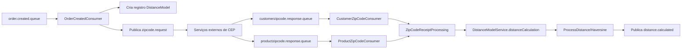

# 🚚 API Distance Calculator ERP

<p align="center">
  <strong>Microsserviço de cálculo de distância para pedidos em um ecossistema ERP orientado a eventos.</strong>
</p>

<p align="center">
  
  
  
  
</p>

## 📌 Visão Geral

Este projeto recebe eventos de criação de pedido, consulta/recebe CEPs de cliente e produto via mensageria e calcula a distância final usando **Haversine**. Ao final, publica um evento com a distância calculada para continuidade do fluxo logístico/frete no ERP.

## ✨ Diferenciais Técnicos

- Arquitetura assíncrona com **RabbitMQ** (baixo acoplamento entre serviços).
- Persistência com **Spring Data JPA + PostgreSQL**.
- Cálculo de distância com estratégia dedicada (`ProcessDistance` + `HaversineDistanceCalculator`).
- Conversão de DTOs isolada em camada própria (facilita manutenção e testes).
- Pronto para evolução para observabilidade e escalabilidade horizontal.

## 🧠 Fluxo de Negócio



## 🧱 Stack

- **Java 17**
- **Spring Boot 3.3.3**
- **Spring Web / Validation / Data JPA / AMQP**
- **PostgreSQL**
- **RabbitMQ**
- **Maven**

## 📂 Estrutura de Pastas

```text
src/main/java/com/distancecalculator/distance_calculator_api
├── client/                # Integração com API de CEP
├── config/                # Configurações RabbitMQ e RestTemplate
├── convert/               # Conversões de entidades e DTOs
├── dto/                   # Contratos de mensageria e integração
├── messaging/
│   ├── consumer/          # Consumo de filas
│   └── producer/          # Publicação de eventos
├── models/                # Entidades JPA
├── repository/            # Repositórios
└── service/               # Regras de negócio e cálculo
```

## ⚙️ Como executar localmente

### 1) Pré-requisitos
- JDK 17+
- Maven 3.9+
- PostgreSQL
- RabbitMQ

### 2) Variáveis de ambiente

Configure antes de rodar:

```bash
export DB_DRIVER=org.postgresql.Driver
export DB_URL=jdbc:postgresql://localhost:5432/distance_db
export DB_NAME=postgres
export DB_PASSWORD=postgres
export JPA_DB=org.hibernate.dialect.PostgreSQLDialect
```

### 3) Inicializar aplicação

```bash
cd distance_calculator_api
./mvnw spring-boot:run
```

A aplicação sobe na porta **8085**.

## 📨 Contratos de Mensageria (alto nível)

- **Consome:** `order.created.queue`
- **Publica:** exchange `distance.exchange` com routing key `zipcode.request`
- **Consome:** `customerzipcode.response.queue` e `productzipcode.response.queue`
- **Publica resultado final:** evento de distância calculada (camada `DistanceCalculatedEvent`)

## 🚀 Roadmap Sugerido

- [ ] Adicionar testes unitários para cálculo e processamento de CEP.
- [ ] Adicionar testes de integração com Testcontainers (Postgres + RabbitMQ).
- [ ] Incluir Docker Compose para ambiente one-command.
- [ ] Expor métricas com Actuator + Prometheus.
- [ ] Adicionar CI com build, testes e análise estática.

## 👨‍💻 Autor

Projeto desenvolvido para demonstrar domínio em:
- microsserviços orientados a eventos,
- integração assíncrona,
- modelagem de fluxo logístico em backend Java.

> Se você é recrutador(a) técnico(a): este repositório mostra habilidades práticas de arquitetura, mensageria e desenho de serviços para cenários reais de ERP.
